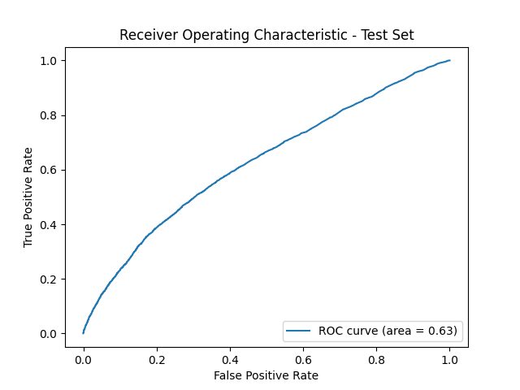

# Tmall_repurchase_prediction
### Group Name: Cheesecake
### Group Member: Yuan Gao, Rongzheng Ma, Tianyi Ma, Huiwen Lian, and Yishan Yuan

# Problem of the project
Merchants sometimes run big promotions on particular dates in order to attract a large number of new buyers. Unfortunately, many of the attracted buyers are one-time deal hunters, and these promotions may have little long lasting impact on sales. 


# Goal of the project
To predict the probability that these new buyers would purchase items from the same merchants again within 6 months.


# Source of dataset
The dataset was provided by the Chinese e-commerce platform Tmall for a coding competition, Repeat Buyers Prediction Challenge.
https://tianchi.aliyun.com/competition/entrance/231576/information


# Data collection methods
Downloading data from the source.

The documentation of the data:

The data contains information about a set of merchants and their corresponding new buyers, including user profiles and behavior logs, collected during the promotion on "Double 11" day.
 <br>


# What isn't in the data?
User income, context about promotions or discounts, product price and ratings, and merchant ratings, etc.
 

# Limitation of data
The dataset only captures a single promotional period (Double 11). Also, user behavior during this period may not represent normal shopping patterns, leading to data bias.


# Limitation of Data

It is necessary to extract features from the user profile table and user log table based on user_id and merchant_id (seller_id), and fill them into the df_train dataframe for training and evaluating the model.

# Work Flow
Feature Engineering -> 5 types of Modeling (Logit, GBDT, XGBoost, Random Forest, and H2O's AutoML) -> Evaluation


## Feature Engineering
Using the `python3 feature_engineering.py` on the cmd to run the data.

**Key tasks in `feature_engineering.py`:** <br>
1. Handling Invalid Values:
Replace invalid values (0 and NULL for age, 2 and NULL for gender) with -1 for visualization, and then convert them to NaN for merging.
 <br>

2. Extracting User & Merchant Features based on user_id and merchant_id (seller_id):
 <br>

3. Merging the features into dataframe:
Fill missing (NaN) values using the last available value in the column to maintain consistency when a user’s attributes are missing.

4. Generates a correlation heatmap for feature relationships:
 <br>

5. Splitting Data & Saving to CSV:
Split the dataframe into 80% train set and 20% test set<br>
<br>
<br>

## Model Evaluation

### Accuracy
Accuracy measures the proportion of correctly classified instances among the total instances:

$$
\text{Accuracy} = \frac{TP + TN}{TP + TN + FP + FN}
$$

where:

- \( TP \) = True Positives  
- \( TN \) = True Negatives  
- \( FP \) = False Positives  
- \( FN \) = False Negatives  


### Precision
Precision, also known as Positive Predictive Value (PPV), is the fraction of relevant instances among the retrieved instances:

$$
\text{Precision} = \frac{TP}{TP + FP}
$$

### Recall
Recall, also known as Sensitivity or True Positive Rate (TPR), measures the ability of the model to capture positive instances:

$$
\text{Recall} = \frac{TP}{TP + FN}
$$

### Area Under the Precision-Recall Curve (AUCPR)
AUCPR represents the area under the Precision-Recall curve, which is used to evaluate models in imbalanced classification problems:

$$
\text{AUCPR} = \int_0^1 P(R) \, dR
$$

where \( P(R) \) represents the Precision-Recall curve.

### Area Under the ROC Curve (AUC)
AUC measures the area under the Receiver Operating Characteristic (ROC) curve, which plots TPR against False Positive Rate (FPR):

$$
\text{AUC} = \int_0^1 TPR(FPR) \, dFPR
$$

where:

$$
\text{FPR} = \frac{FP}{FP + TN}
$$


## Logistic Regression for Repurchase Prediction

**Processing Logic:**<br>
The goal of this project is to use a logistic regression model to predict whether a customer will repurchase an item based on various features. The process involves:<br>
1.	Data Preparation: Loading and preprocessing data from train_set.csv and test_set.csv.<br>
2.	Feature Selection: Using customer behavior metrics as predictive features.<br>
3.	Model Training: Splitting data into training and validation sets, scaling, and training a logistic regression model.<br>
4.	Evaluation: Assessing model performance using validation accuracy, confusion matrix, ROC curve, and Precision-Recall curve.<br>
5.	Prediction on Test Data: Making final predictions and saving the results.<br>

**Key Functions:** <br>
`strain_test_split(X, y, test_size=0.2, random_state=42, stratify=y): `: Splits the dataset into training and validation sets. test_size=0.2: Allocates 20% of the data for validation<br>
`scaler = StandardScaler()`: Standardizes numerical features by removing the mean and scaling to unit variance. <br>
`logit_model = LogisticRegression(solver="liblinear", max_iter=1000, random_state=1)`: Uses logistic regression to predict binary outcomes (0 or 1). max_iter=1000: Increases the number of iterations to ensure convergence.<br>
`test_df["predicted_label"] = logit_model.predict(X_test_scaled)`
`test_df["predicted_proba"] = logit_model.predict_proba(X_test_scaled)[:, 1]`: Predicts purchase behavior on new customers. <br>
`sns.heatmap`:Displays a heatmap representation of the confusion matrix. <br>
`fpr, tpr, _ = roc_curve(y_val, y_probs)`
`roc_auc = auc(fpr, tpr)`:Calculates AUC (Area Under Curve)<br>


**Results & Figures:** <br>
Validation Accuracy: 0.938<br>
Cross-validation Accuracy: 0.939<br>

Confusion Matrix
<p align="center">
  
</p>

•	High accuracy but imbalanced predictions.
•	Many false negatives (Repeat customers predicted as Not Repeat).

ROC Curve

<p align="center">
  
</p>

•	AUC = 0.62, indicating moderate predictive ability.

**Limitations:**
1.	Class Imbalance: Most customers do not repurchase, leading to poor recall. <br>

2.	Model Selection: Logistic regression is linear. <br>


## GBDT

### Overview
Gradient Boosting Decision Trees (GBDT) is an ensemble learning technique that builds multiple weak decision trees sequentially, with each new tree correcting the errors of the previous ones. It is particularly effective for structured data and can capture complex patterns in customer behavior.

### Data Processing & Modeling Steps

- **Feature Engineering:**
  - Removed irrelevant identifiers such as `user_id`, `merchant_id`, and the target label.
  - Incorporated behavioral and transactional features extracted from user logs.

- **Data Splitting:**
  - Training Set: 80%
  - Validation Set: 20%

- **Hyperparameter Optimization:**
  - Employed **RandomizedSearchCV** with 3-fold cross-validation to fine-tune model parameters.
  - Optimal parameters identified:
  ```
  n_estimators = 1200
  learning_rate = 0.0114
  max_depth = 4
  min_samples_leaf = 18
  subsample = 0.7
  max_features = 0.9
  ```

### Model Performance

- **Cross-validation ROC AUC:** `0.6227`
- **Validation ROC AUC:** `0.6105`

#### Classification Report (Validation Set):

<div align="center">
  
| Class | Precision | Recall | F1-score |
|:-------:|:-----------:|:--------:|:----------:|
| 0 (Not Returning) | 0.94 | 1.00 | 0.97 |
| 1 (Returning) | 0.15 | 0.00 | 0.00 |

</div>

- The model effectively identifies non-returning customers but struggles with classifying returning customers due to the **severe class imbalance**.

### Limitations and Future Enhancements

- **Class Imbalance:**
  - The dataset is highly imbalanced, significantly affecting recall for returning customers.
  - Potential solutions include **SMOTE (Synthetic Minority Over-sampling Technique)** or **cost-sensitive learning**.

- **Feature Engineering:**
  - Incorporating additional behavioral, demographic, and historical purchase data could improve predictive power.

- **Alternative Models:**
  - Exploring **XGBoost** or **LightGBM** might yield better performance.

- **Ensemble Methods:**
  - Combining multiple models could enhance accuracy and robustness.

### Visualization
<p align="center">
  
</p>

The ROC curve illustrates the model’s performance. A **ROC AUC of 0.61** suggests limited predictive capability, indicating the need for further refinement and feature optimization.

## XGBoost

### Overview
Extreme Gradient Boosting (XGBoost) is a powerful and efficient implementation of gradient boosting, designed for high performance and scalability. It is particularly effective for structured data and is widely used for classification and regression tasks. XGBoost employs a combination of decision trees and boosting techniques to minimize error iteratively, making it an ideal choice for customer behavior prediction.

### Data Processing & Modeling Steps

- **Feature Engineering:**
  - Removed irrelevant identifiers such as `user_id`, `merchant_id`, and the target label.
  - Incorporated behavioral and transactional features extracted from user logs.

- **Data Splitting:**
  - Training Set: 80%
  - Validation Set: 20%

- **Hyperparameter Optimization:**
  - Employed **RandomizedSearchCV** with 3-fold cross-validation to fine-tune model parameters.
  - Optimal parameters identified:
  ```
  n_estimators = 100
  learning_rate = 0.0422
  max_depth = 3
  min_child_weight = 15
  subsample = 0.75
  colsample_bytree = 1.0
  ```

### Model Performance

- **Validation Performance:**
  - **Validation ROC AUC:** `0.63`
  - **Best threshold (Validation Set):** `0.5879`

#### Classification Report (Validation Set):

<div align="center">
  
| Class             | Precision | Recall | F1-score |
|:-----------------:|:---------:|:------:|:--------:|
| 0 (Not Returning) | 0.95      | 0.69   | 0.80     |
| 1 (Returning)     | 0.09      | 0.49   | 0.16     |

</div>

- The model demonstrates improved recall for returning customers compared to GBDT but still exhibits significant class imbalance issues.

#### Test Set Evaluation (After Threshold Tuning):

<div align="center">

| Class             | Precision | Recall | F1-score |
|:-----------------:|:---------:|:------:|:--------:|
| 0 (Not Returning) | 0.95      | 0.87   | 0.91     |
| 1 (Returning)     | 0.12      | 0.28   | 0.17     |

</div>

- **Test Accuracy:** `0.8336`
- The threshold tuning helped improve recall for returning customers but at the cost of reduced precision.

### Limitations and Future Enhancements

- **Class Imbalance:**
  - The dataset is highly imbalanced, affecting the recall of returning customers.
  - Techniques like **SMOTE**, **focal loss**, or adjusting `scale_pos_weight` could improve performance.

- **Feature Engineering:**
  - Additional features, such as customer demographics, browsing patterns, and purchase frequency, could enhance predictive power.

- **Alternative Models:**
  - Comparing with **GBDT**, **LightGBM**, or ensemble methods may lead to better performance.

### Visualization
<p align="center">
  
</p>

The ROC curve illustrates the model’s performance on the test set. A **ROC AUC of 0.63** indicates that while the model has improved over GBDT, further optimizations are needed for better prediction accuracy.

## Randomforest Regression

### Processing Logic:
The goal of this project is to use a randomforest regression model to predict whether a customer will repurchase an item based on various features. The process involves:<br>

- **Data Preparation:** 
  - Loading and preprocessing data with 80% training set split and feature scaling

- **Model Parameter Selection:** 
  - Using 2-fold cross validation of grid search to locate the optimal parameter choice

- **Model Hyperparameter Search:**
  - Use 100-folds stratified cross validation grid search with narrower scope
 
- **Model Evaluation:**
  - Assessing model performance using balanced accuracy score, AUC-PR, weighted precision, weighted recall,weighted F1 score.

- **Test Threshold and Predict:** 
  - Test different value of threshold and make final predictions on test set.

### Key Functions:

 - `skf = StratifiedKFold(n_splits=2, shuffle=True, random_state=42))`: stratified two folds coarse grid search for selecting parameters<br>
 - `cv = StratifiedKFold(n_splits=100, shuffle=True, random_state=42)`: stratified 100 folds fine-grained gird search for optimal value of focal parameter <br>
 - `model = RandomForestClassifier(**params)`<br>
 - `y_test_prob = best_model.predict_proba(X_test_scaled)[:, 1]`:predicted probability of repurchase
 - `y_test_pred_fixed = (y_test_prob >= fixed_threshold).astype(int)`: predicted labels of repurchase <br>
 - `def calculate_auc_pr(y_true, y_prob):`precision, recall, _ = precision_recall_curve(y_true, y_prob) return auc(recall, precision) <br>
 - `val_accuracy = balanced_accuracy_score(y_val, y_val_pred_baseline)`: balanced accuracy score  <br>
 - `val_precision = precision_score(y_val, y_val_pred_baseline,average='weighted')`:weighted precision <br>
 - `val_recall = recall_score(y_val, y_val_pred_baseline,average='weighted')`:weighted recall <br>
 - `val_f1 = f1_score(y_val, y_val_pred_baseline,average='weighted')`: weighted f1 score <br>

### Results & Figures:

- **Baseline Model:**
  - Default 100 trees test
```
base_params = {
    'n_estimators': 100,
    'max_depth': None,
    'min_samples_split': 2,
    'min_samples_leaf': 1,
    'random_state': 42
}
```

<div align="center">

| Metrics            | Training  | Validation |
|:------------------:|:---------:|:----------:|
| AUC-PR |   1.0000 | 0.0807  |
| Weighted Precision | 0.9999  | 0.8867 |
| Weighted Recall | 0.9999  | 0.9376 |
| Weighted F1-Score | 0.9999  | 0.9086 |
| Balanced Accuracy | 0.9995  | 0.5003 | 

<div>


<div align="left">
- **First Stage Parameter Search:** 
  - Iterate focal input values while fix other input as default model
 
```
param_values = {
    'n_estimators': [1, 10, 20, 30],
    'max_depth': [1, 5, 8, 15, None],
    'min_samples_split': [2, 10, 20, 35, 50],
    'min_samples_leaf': [1, 5, 10, 15, 30, 50]
    'max_features': ['sqrt', 'log2', None]
}
```
<div>


- **Optimal value Selection:** 
  - Iterate single input Grid Search with fine-grained steps while set other inputs as safe values inferred from last step to avoid overfitting
 ```
fine_param_grid = {
    'max_depth': [1],
    'min_samples_leaf': [8,9,10,11,12],
    'min_samples_split': [10,12,14,16,18,20,22,24,26,28,30],
    'n_estimators': [1],
    'max_features': [None],
    'random_state': [42]
}
 ```

**Best parameters: `max_depth=1`,`n_estimators=1`,`min_samples_leaf=8`,`min_samples_split=10`,`max_features=None`,`random_state=42`**

 - Baseline model - Validation AUC-PR: `0.0807`<br>
 - Best fine-tuned model - Validation AUC-PR: `0.1295`<br>
 - Absolute improvement: `0.0488`<br>
 - Percentage improvement: `60.52%`<br>

<p align="center">
  
</p>

- **Optimal value Selection:** <br>
 - Fixed threshold: `0.1`<br>
 - Test set AUC-PR: `0.1572`
 - Test Accuracy: `0.8930`<br>
 - Test set Weighted Precision: `0.8950`<br>
 - Test set weighted Recall: `0.8930`<br>
 - Test set Weighted F1-Score: `0.8940`<br>

### Limitations: 

- **Imbalanced Set:** 
  - there are extremly limited positive cases in raw data,exerting a huge risk of caputuring enough variation for prediction in cross-validation splits even ajusted by weighted measure or endeavors to avoid overfitting (decreasing n_estimators and max_depth while increasing min_samples_leaf and min_samples_splits)
- **Limited Features:**
  - the limited number of features at hand makes it hard to test different combination of feature subset (refer to the decreasing performance after restrict feature inputs)


## Stacking Model

### Overview 

In our project, we employed a Stacked Ensemble Model to improve the prediction accuracy for customer repurchase behavior. Stacking, or stacked generalization, is an ensemble learning technique that combines multiple base models to form a stronger predictive model. This approach leverages the strengths of various algorithms to achieve better performance than individual models.​

The stacking process involves training several base models on the same dataset and then using their predictions as inputs for a higher-level meta-model, which makes the final prediction. This meta-model learns how to best combine the base models' outputs to enhance overall performance.​

In our implementation, we utilized H2O's AutoML functionality to automatically train and evaluate a variety of models, including Generalized Linear Models (GLM), Gradient Boosting Machines (GBM), and Distributed Random Forests (DRF). The AutoML process selected a Stacked Ensemble as the best-performing model.​

### Best Stacking Model

Details of the Best Stacking Model:

<pre>
    Model Type: Stacked Ensemble​
    Stacking Strategy: Cross-validation​
    Number of Base Models (Used/Total): 5/20​
    GBM Base Models (Used/Total): 4/17​
    GLM Base Models (Used/Total): 1/1​
    DRF Base Models (Used/Total): 0/2​
    Metalearner Algorithm: GLM​
    Metalearner Fold Assignment Scheme: Random​
    Metalearner Number of Folds (nfolds): 2​
    Custom Metalearner Hyperparameters: None​
</pre>

### Model Performance

<p align="center">
  
</p>

## Model Evaluation Results

<div align="center">
  
|       Model            |  Accuracy  |  AUCPR  | Precision |  Recall  |   AUC   |
|:----------------------:|:---------:|:-------:|:---------:|:--------:|:-------:|
|       XGBoost         |   0.8336   |  0.1083 |   0.1217  |  0.2828  |  0.6271 |
|    H2O AutoML        |   0.8269   |  0.1093 |   0.1203  |  0.2962  |  0.6257 |
| Gradient Boosting    |   0.9397   |  0.1081 |   0.3333  |  0.0003  |  0.6258 |
|   Random Forest      |   0.8930   |  0.0694 |   0.1284  |  0.1338  |  0.5377 |
| Logistic Regression  |   0.9394   |  0.1080 |   0.1739  |  0.0013  |  0.6230 |
<div>

<div align="left">

### Best Model Selection

From the evaluation results, we observe the following key insights:

- The best model in terms of AUCPR (0.1093) is H2O AutoML, which slightly outperforms XGBoost (0.1083) and Gradient Boosting (0.1081).

- Accuracy is highest for Gradient Boosting (0.9397) and Logistic Regression (0.9394), but these models show extremely low recall values (0.0003 and 0.0013, respectively), indicating that they fail to capture positive instances effectively.

- Recall is highest for H2O AutoML (0.2962) and XGBoost (0.2828), suggesting that these models better identify the positive class.

- Precision is highest for Gradient Boosting (0.3333), but with an almost negligible recall (0.0003), making it unreliable for practical use.
<div>

## Limitation and Extension

### 1. Imbalance data

The dataset contains an extremely limited number of positive cases, leading to an imbalance issue that may negatively impact model performance. To mitigate this, we can explore the following approaches:

- Oversampling: Techniques such as SMOTE (Synthetic Minority Over-sampling Technique) can be used to generate synthetic samples for the minority class.

- Undersampling: Reducing the number of negative samples to balance the class distribution.

- Class Weight Adjustment: Assigning higher weights to the positive class in models like Logistic Regression, XGBoost, or Gradient Boosting to prevent them from being biased toward the negative class.

### 2. Limited Features

Currently, we only have around 10 features, which may limit the model’s ability to capture complex patterns in the data. To improve feature representation, we can:

- Create interaction terms: Introduce polynomial or cross-product features to capture non-linear relationships.

- Feature extraction: Construct meaningful features from raw data (e.g., aggregating historical behaviors, time-based features, or merchant and product features).

### 3. Exploring Alternative Models

The current models rely on traditional ML approaches (GBM, RF, GLM), but some deep learning models may offer additional improvements. We can also try deep learning models and the XGBoost model in the stacking model.


